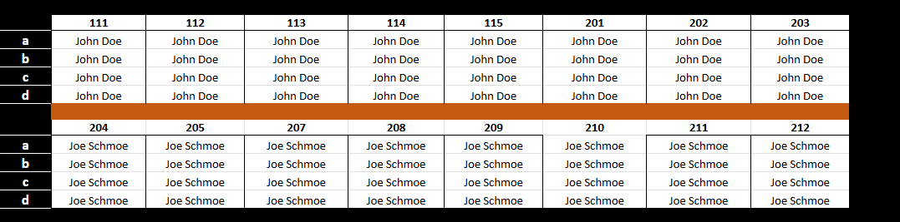
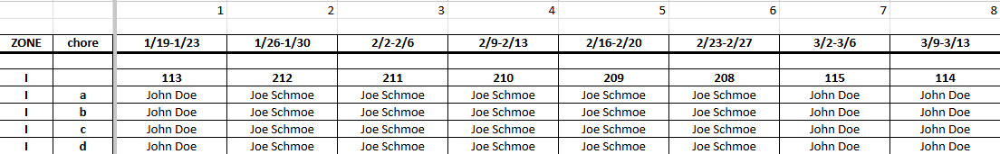
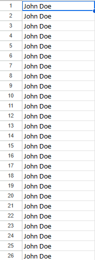
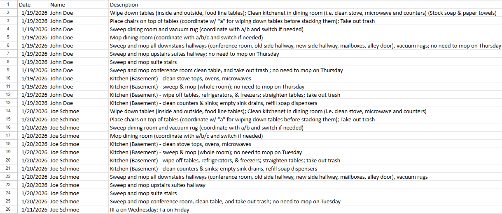
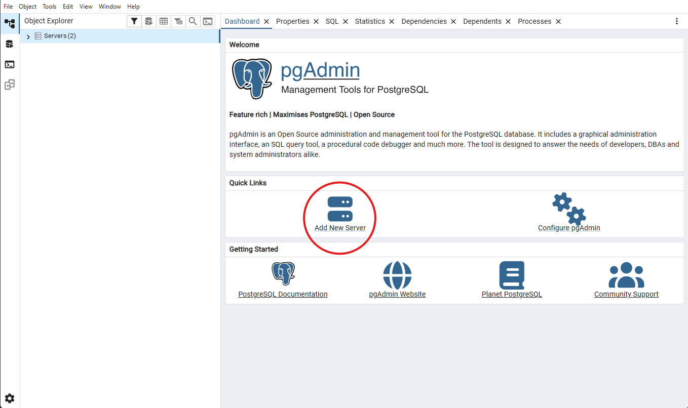
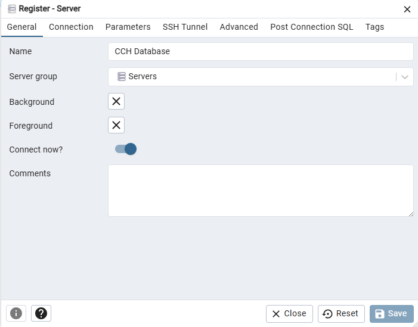
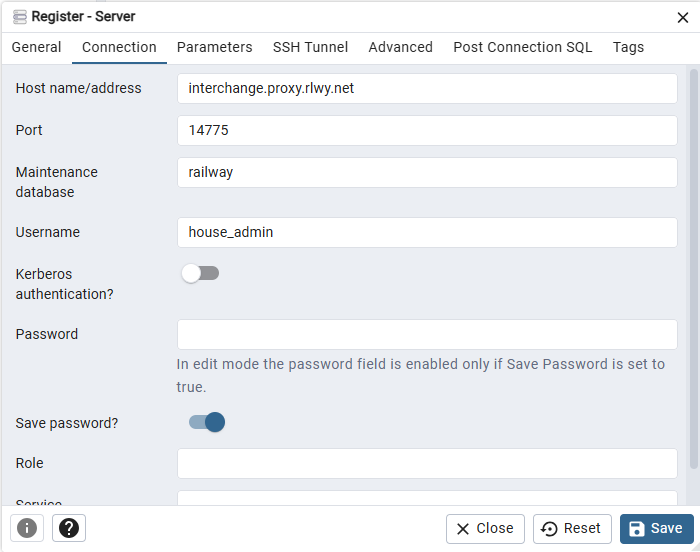
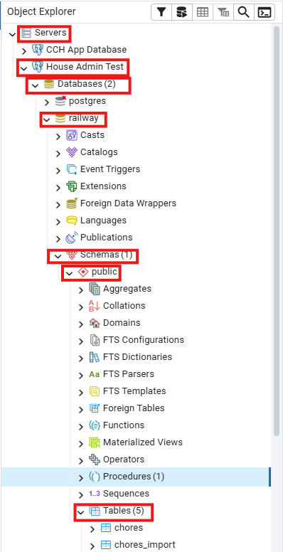
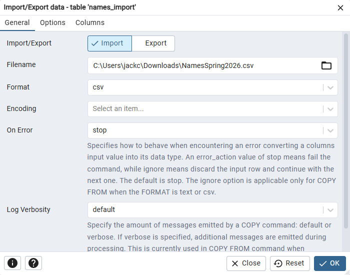
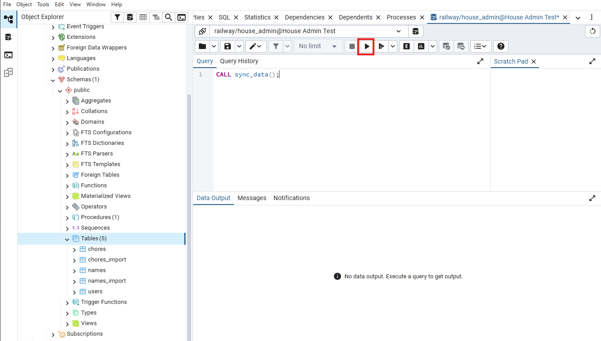

### Instructions For House Admin:

Before every semester, the new residents will need to be added to the database, and old chores will need to be purged. To do this, follow these steps EXACTLY:

### Names

- Request from the current house minister a Google Sheet with the updated residents and chores for the current semester. We will refer to this as `Updated Chores`.
- Request the Google Sheet file `Chores Document for App` from the previous admin.
- Navigate to the `Control` tab in the "Chores Document for App" Google Sheet.
    - From the `Updated Chores` Google Sheet, copy and paste the names from the `Control` sheet into the `Chores Document for App`'s `Control` names section.
    - The names should be formatted exactly as such:
        - Firstname Lastname
    - If all is done properly, you should end up with a result looking like this:



### Dates

- Navigate now to the `New_Room` sheet in the `Chores Document for App` Google Sheet.
- The dates going from cell `D3:S3` will almost surely be incorrect. You will need to correct them for the specific semester.
- Go onto your calendar app of choice, and starting with the first week of classes for the semester, fill out the dates for all 16 weeks of the semester.
- This will be in cells `D3:S3`. Start with `D3` and move down the line to `S3` at the end.
- The format MUST be in this format, with NO preceding 0's:
    - `Month/Day-Month/Day`
    - EX: `4/13-4/17`, `9/29-10/3`, etc
- Depending on the semester, there will be a week skipped for either Spring Break or Fall Break. Take this into account when updating the dates, and check on the offical Missouri S&T website to be sure.
- Once done, you will have a result such as this:



- NOTE: Should go all the way to 16 weeks, screenshot only goes to 8 for compactness.
- Next, navigate to the `Old_Room` sheet in the `Chores Document for App` Google Sheet.
- Copy and paste the exact contents of `D3:S3` that you just updated in `New_Room` into cells `D3:S3` in the `Old_Room` tab.

### Names Output

- Once the above steps are done, the Google sheet will have generated a list of all the names and chores for all residents for the semester. Start first on exporting the names.
- Navigate to the `Names` tab in the bottom of the `Chores Document for App` Google Sheet. It should have generated a long list of names such as this:



- NOTE: Cells should go down to row 64.
- Confirm that this looks correct. Then navigate to `File -> Download -> Comma Seperated Values (.csv)` button in the top right of the Google Sheet. Click this button to download the names as a CSV file on your computer.
- Save the file as: `Names<season><year>.csv`
- EX: `NamesSpring2026.csv`

### Chores Output

- Next step is to export the chores.
- Navigate to the `Output` tab in the bottom of the `Chores Document for App` Google Sheet. It should have generated a long list of names such as this:



- NOTE: Cells should go down to row 1793.
- Confirm that this looks correct. Then navigate to `File -> Download -> Comma Seperated Values (.csv)` button in the top right of the Google Sheet. Click this button to download the chores as a CSV file on your computer.
- Save the file as: `Chores<season><year>.csv`
- EX: `ChoresSpring2026.csv`

With these 2 CSV files, you now have everything you need to update the database for the semester.

### Downloading PGAdmin

With these 2 CSV files, the database can now be updated. We use a tool called PGAdmin to update the database.
- If you have not downloaded PGAdmin, you can do so at this link:
- https://www.pgadmin.org/
- Follow the installer instructions and open PgAdmin after installing.

### Logging Into PGAdmin

- Once you are into PGAdmin, you will need to connect to the database, and login as the admin user.
- To do this, navigate to the 'Add New Server' button on the main dashboard after opening PGAdmin
    - Alternatively, if the dashboard for whatever reason didn't open, you can achieve the same thing by right-clicking on `Servers -> Register -> Server`



- You will then see a popup saying 'Register Server'.
- With the tab on the top of the popup being set to `General`, type a name for the connection.
- EX: `CCH Database`



- Navigate to the `Connection` tab in the top of the popup.
- Fill in the fields with these values:
    - Host name/address: `interchange.proxy.rlwy.net`
    - Port: `14775`
    - Maintenance database: `railway`
    - Username: `house_admin`
    - Password: `password`
        - NOTE: Get the password from the previous house admin.
    - Check 'Save Password'
- When finished, click 'Save' at the bottom right.



### Loading in the New Data

You should now be connected to the database as the `house_admin` user.

Next, click the down arrow to expand the `Servers` dropdown on the left.
- Find the Server with the name that you just created
- EX: `CCH Database`
- Continue expanding using the arrow to reach: `Databases -> railway -> Schemas -> public -> Tables`



There should be 5 tables. The ones we are interested in are `names_import` and `chores_import`.
- Right click on `names_import`, and click `Import/Export Data`
- A popup will open.
    - In the `General` tab, ensure `Import` is selected.
    - In the Filename field, click the file icon on the right to open the File Explorer on your computer and select the Names CSV that you downloaded from the Google Sheet earlier.
    - Format: `csv`
    - On Error: `stop`
- Once all these steps are done, click 'OK'.



Repeat the same process for `chores_import`, with the only difference being use the Chores CSV from earlier in the Filename field instead of the Names CSV.
- NOTE: If the CSV for the chores has headers at the top row, you will need to navigate to `Options -> Header` and toggle it on.
- EX: If the CSV starts with:

```
Date,Name,Description
1/19/2026,Joe Schmoe,Clean up trash
...
```
- The CSV has a header, so you will need to toggle the 'Headers' button.

### Updating the Final Database

Once these steps are finished, you are almost done! The last step is to simply call the procedure used to update the database tables based on the new data you just imported.
- Right click on the `Tables` tab in the `Object Explorer` on the left side, and click on `Query Tool`
- It will open a window where you can run SQL queries.
- Copy and paste this SQL into the text box:

```sql
CALL sync_data();
```

- Click the `Execute Script` play button at the top (or type the `F5` Key) to run the query.



- If everything has been done correctly, the procedure will exit with a success, and the database will be updated.
- You can now safely exit out of PGAdmin, the database is fully updated for all users!

### Troubleshooting
- If the `sync_data()` procedure fails, it is because the `names_import` or `chores_import` have invalid rows of data.
`names_import` must have exactly `64` names, and `chores_import` must have exacly `1792` chores.
- To check this, you can run either of the respective SQL queries to check the count:

```sql
SELECT COUNT(*) FROM chores_import;
SELECT COUNT(*) FROM names_import;
```

- If either import table has an incorrect count, the procedure will have failed.
- You will need to backtrack through previous steps to ensure you did not make a mistake causing the data imported to be of the wrong size.
    - NOTE: A common error is failing to toggle `Headers` when importing the `chores_import`, or failing to remove the headers in the CSV before importing.
    - Check to make sure that this is not causing your issue.