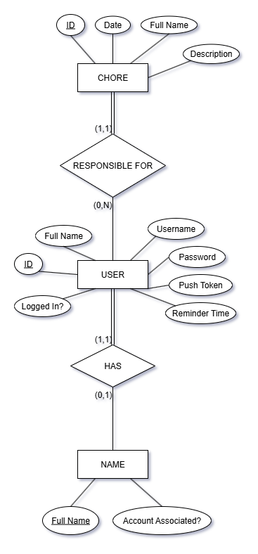

## CCH App Backend

This is the backend repo for the [Christian Campus House app](https://github.com/jackcase04/cch-app-mobile) chores reminder app. It manages chores and notifications for 64 residents, automating what was previously done manually with Excel.

IMPORTANT: If you are a house admin, navigate to [INSTRUCTIONS.md](INSTRUCTIONS.md) for instructions on updating the database.

---

### Features

- REST API made with **Java Spring Boot**
- User authentication
- Chore scheduling
- Scheduled push notifications
- **PostgreSQL** database

---

### Infrastructure and Deployment

### Migration to Railway (January 2026)

This project was initially deployed using **AWS Elastic Beanstalk** with **PostgreSQL** on **AWS RDS**. While technically sound and successfully serving the house for a full semester, the project was unnecessarily costly for a small, fixed user base.

As of **January 27, 2026**, the backend application and PostgreSQL instance were migrated to Railway in order to:
- Reduce cloud costs
- Simplify deployment and database management

This migration preserved the existing architecture while simplifying the deployment and management process for this student-run organization.

---

### Technologies

- Language: Java
- Framework: Spring Boot
- Database: PostgreSQL
- Infrastructure: Railway (formerly AWS Elastic Beanstalk, AWS RDS)
- CI/CD: Railway-managed build and deployment

---

### Design Decisions

- Used PostgreSQL due to fixed data size and strong relational constraints
- Prioritized cost efficiency and simplicity over horizontal scalability
- Centralized admin operations via database-level procedures to reduce risk of accidental data corruption

---

### Impact

- **64 active residents** rely on the app for daily chore reminders
- Eliminated a manual Excel-based workflow used by house leadership
- Reduced missed chores through automated scheduling and notifications

---

### Database
Database ER Diagram:  

---

### Future Work

- [ ] Rework notification scheduling approach away from a polling approach. This will help reduce cloud costs.
    - Potentially consider Client side scheduling
- [ ] Look into self-hosting for even cheaper costs.
- [ ] Admin dashboard for chore/role management.
- [ ] Analytics on task completion.
    - EX: Task completed at `timestamp`, etc
